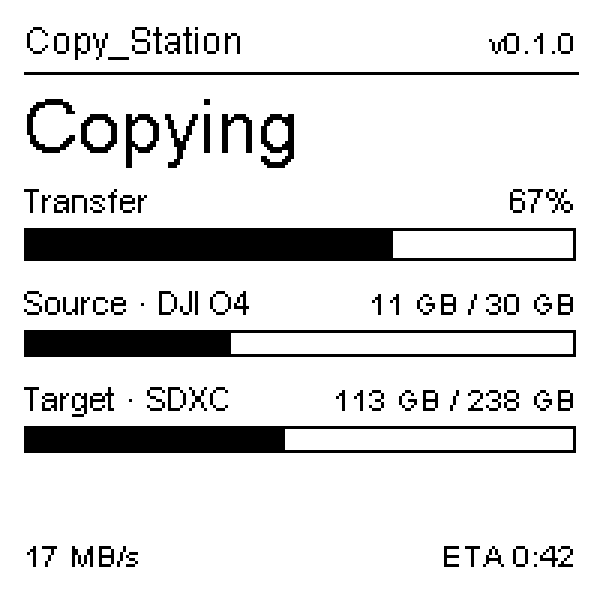
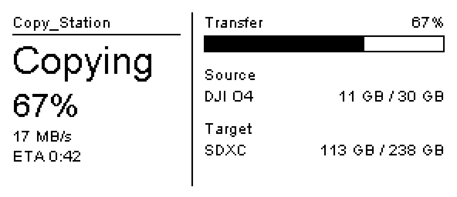
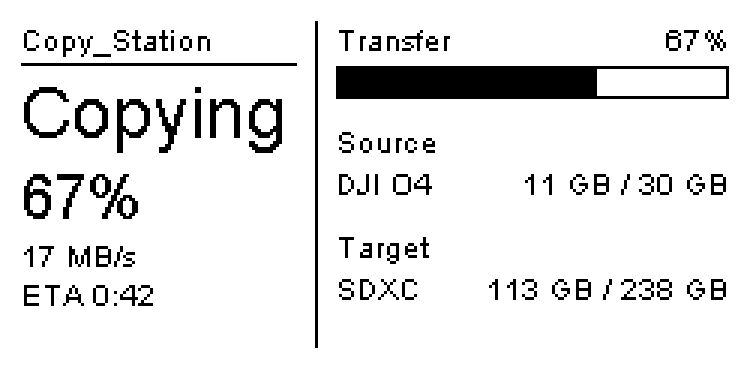
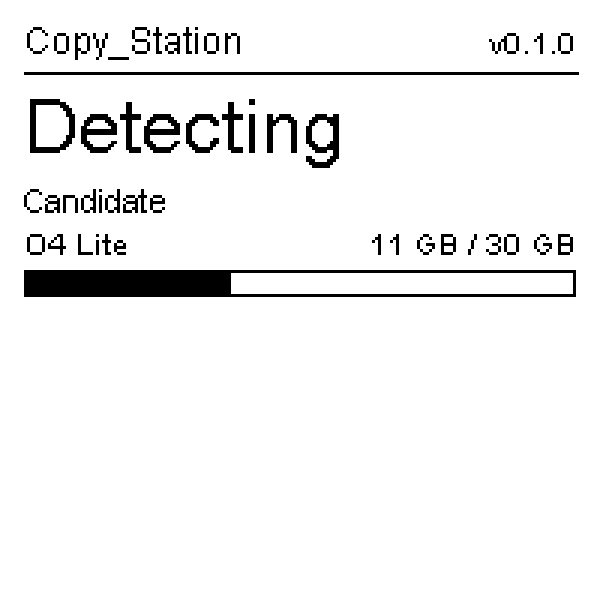
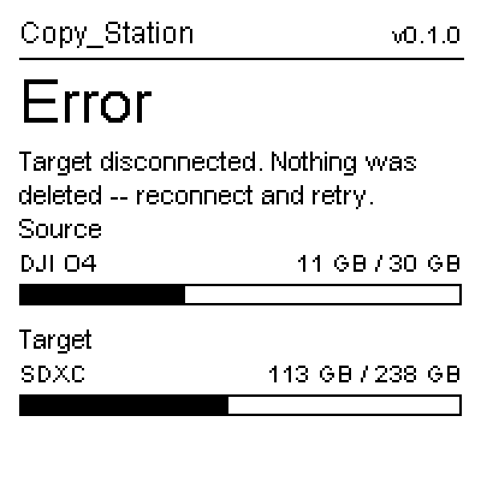

# Copy_Station

Autonomous copy station: automatically transfers the footage of a camera
connected via USB as mass storage (e.g. **DJI O4 Air Unit**, `DCIM` folder) onto
a **(micro) SD card**, verifies the transfer and then clears the source. Runs as
a headless systemd service on a **Radxa Cubie A7S** (`radxa-a733-bullseye-cli-r6`)
or a **Raspberry Pi 4 / 5** (Raspberry Pi OS Bookworm 64-bit).

## Contents

* [Flow](#flow)
* [Web interface](#web-interface-optional)
  * [File access & download](#file-access--download-optional)
  * [Video transcoding](#video-transcoding-optional)
* [WiFi access point](#wifi-access-point-optional)
* [E-Paper display](#e-paper-display-optional)
* [WS2812B / NeoPixel strip](#ws2812b--neopixel-strip-optional)
* [Grove LED Bar v2.0](#grove-led-bar-v20-optional)
* [Powering off safely](#powering-off-safely)
  * [User button](#user-button-optional)
* [Development (without hardware)](#development-without-hardware-eg-windows)
* [Deployment](#deployment)
* [Source/target detection](#sourcetarget-detection)
* [Configuration](#configuration)
* [Changelog](CHANGELOG.md)

## Flow

```
Ready ──device detected──► Detecting ──source+target ok──► Copying
  ▲                                                          │
  │                                              verify (size+count)
  │                                                          │
  └────────── devices removed ◄── Success ◄──── clear source DCIM
                              (error ⇒ Error, source left untouched)
```

* **Detection:** event-driven -- source and target may be plugged in **in any
  order and at different times**. The set of attached volumes is re-evaluated on
  every USB add/remove event; a transfer starts as soon as two eligible volumes
  are present. Works with whole-disk devices that carry a filesystem directly
  (no partition table) -- the O4 Air Unit exposes its storage this way.
* **Copy:** into a new folder `transfer_<NNNN>_<source_name>` -- nothing is ever
  overwritten. The running number is persisted on the SD card.
* **Verification:** fast comparison of file count and file sizes.
* **Cleanup:** only on success; only the `DCIM` contents are deleted, never
  formatted.
* **Resilience:** if the source or target is unplugged mid-copy the copy aborts
  and reports which side dropped out -- promptly (~1 s) when the whole USB device
  is removed, or once the kernel hits the I/O error when only a card is pulled
  from a still-connected reader. Either way the source is never deleted unless
  verification succeeded.
* **Status:** `Ready / Detecting / Copying / Error` via interchangeable backends
  (log, LEDs, buzzer, WS2812, Grove LED Bar, e-paper -- freely combinable). On the bar
  backends each newly detected volume blinks green **twice** and then shows a
  **white gauge of how full that volume is for ~3 s** (then a slow **magenta**
  pulse while it waits -- clearly not the green idle); a connected source with
  nothing to copy holds **blue** briefly; an **error** (e.g.
  a device unplugged mid-copy) blinks **all LEDs red** until the devices are
  removed -- so each phase is unmistakable at a glance. The bar **wipes once when
  the service starts** and goes **fully dark when it stops**.

## Web interface (optional)

Set `web.enabled: true` in the config to host a local status page on **all
network interfaces** (`0.0.0.0:8080` by default). It shows live phase, copy
progress (percent, elapsed, ETA, **speed**), the **detected devices** with their
assigned role (source/target/candidate) and used/total storage, and a scrolling
**activity log** of recent actions (newest first); it is prepared for future
settings. Binding to `0.0.0.0` makes it robust to interfaces going down/up at
runtime -- no per-interface rebinding.

The frontend is a single static page (vanilla JS, no build step) that polls
`/api/status` every 500 ms; the backend is FastAPI (`/docs` for the auto API
docs). Open `http://<device-ip>:8080/`.

**Access control (optional).** Once file download or the WiFi AP are in play you
may want the interface behind a password. Set `web.auth.enabled: true` with a
`username`/`password` and the whole interface (status, files, transcode) is
guarded by HTTP Basic auth. It is off by default (unchanged behaviour), and
**fail-safe**: enabling it with an empty password rejects every request rather
than leaving it open.

### File access & download (optional)

Set `web.files.enabled: true` (default on when the web interface is enabled) to
browse and download the footage of the **attached mass storage** directly from
the web UI -- pick a volume, walk its folders, download a file. Only the
**USB volumes are ever exposed; the board's OS card is never listed or
reachable** (the same OS-exclusion the copy logic uses). Access is **read-only**:
the browser mounts each volume read-only under a separate mount base
(`web.files.browse_base`), so it can never modify or corrupt a card, and releases
it again after `idle_unmount_seconds` of inactivity. Downloads are streamed;
path traversal (`..`, symlinks) is refused. Set `web.files.allow_download: false`
to allow browsing but not downloading.

### Video transcoding (optional)

Set `transcode.enabled: true` (and install **ffmpeg**, which `scripts/install.sh`
pulls in) to re-encode / downscale a video from the web UI: browse to a clip in
**Files**, press the **⚙** button, pick a preset and an output volume. The job
runs in the background with a live progress bar; the result is written to a
`Transcoded/` folder (`transcode.output_dirname`) on the **target volume**
(read-write) and is downloadable through the file browser.

Presets are configurable (`transcode.presets`): each sets a target `height`
(downscale keeping the aspect ratio; `0` keeps the source resolution), a video
codec (`libx264`/`libx265`), a CRF quality and an ffmpeg speed preset. The
default set offers 1080p/720p H.264 and 720p H.265.

**Speed (software encoding).** The `preset` field is libx264/libx265's
speed/size trade-off and defaults to **`veryfast`** -- a good choice on an SBC,
where software encoding is CPU-bound (much faster than `medium` for a modest size
increase). Use `ultrafast` for the most speed (larger files) or `fast`/`medium`/
`slow` for smaller files. Software encoding matters on a board without a usable
hardware encoder for the chosen output -- the Pi 5, or the Cubie A7S when an
**H.265 output** preset is picked (its H.265 encoder is not exposed; H.264 output
*is* hardware-accelerated). There a heavy source -- e.g. **4K60** drone footage
-- is dominated by *decoding*, so expect well under real-time; a lower `height`
and a faster `preset` are the levers that matter. (`preset` is ignored by
hardware encoders, which are bitrate-controlled.)

**Hardware acceleration.** `transcode.acceleration` controls the encoder, and the
station picks the best one for the board automatically -- the three supported
boards differ a lot in what they can encode in hardware:

| Board | Hardware encode | `auto` uses |
|-------|-----------------|-------------|
| Raspberry Pi 4 | H.264 (`h264_v4l2m2m`, `/dev/video11`) | hardware H.264, CPU for H.265 |
| Raspberry Pi 5 | **none** -- the encoder block was removed | CPU (`libx264`/`libx265`) |
| Radxa Cubie A7S | H.264 in the SoC via **GStreamer OpenMAX** (`omxh264videoenc`); hardware H.264/H.265 **decode** too (`omxh264dec`/`omxhevcvideodec`). No H.265 hardware *encoder*. | hardware H.264 (GStreamer), CPU for H.265 output |

> **Cubie A7S note.** The Allwinner A733 encodes H.264 in hardware, but **not
> through ffmpeg** -- only through GStreamer's Allwinner OpenMAX element
> `omxh264videoenc` (driving `/dev/cedar_dev`). The station therefore runs a
> **GStreamer pipeline** on the Cubie: it hardware-**decodes** the source
> (`omxh264dec` / `omxhevcvideodec`, so even a 4K clip never hits the CPU) and
> downscales **in the decoder** via its `scale` property (1/2 or 1/4), then
> hardware-encodes H.264. So a target that is exactly the source height /2 or /4
> is a single hardware pass with the CPU essentially idle (~0.7× real-time for
> 4K60) -- for a 4K source that is **1080p** (1/2) and **540p** (1/4). The
> encoder's *own* scaler is deliberately not used -- it leaves a thin magenta line
> on the bottom row -- so a target that is **not** a clean 1/2-step (e.g. 720p from
> 4K) is decoded/downscaled to the nearest larger clean size in hardware and then
> **finished to the exact height by a short ffmpeg (CPU) pass**. There is **no
> H.265 hardware *encoder*** exposed, so H.265 *output* stays on the CPU (H.265
> *input* is still hardware-decoded). The OMX plugin is present on Radxa images;
> check with `gst-inspect-1.0 | grep omx`. The daemon runs as root, so it can open
> the VPU's root-only device nodes (`/dev/cedar_dev`, `/dev/dma_heap`). A source
> with non-AAC audio or an unusual container is handled by the CPU path instead
> (audio is stream-copied on the hardware path, so it must already be AAC).

* `acceleration: auto` (default) uses the board's hardware encoder **when the
  installed ffmpeg actually has it**, otherwise software.
* `acceleration: cpu` forces software; a specific ffmpeg encoder name (e.g.
  `h264_v4l2m2m`) forces that one. A per-preset `accel:` overrides the global one.
* **Automatic fallback:** if a hardware encode fails at runtime (missing device
  node, unsupported input, driver error), the partial output is discarded and the
  job retries with the next candidate -- ultimately the CPU -- so a job does not
  fail just because hardware encoding is unavailable. Set `fallback_to_cpu: false`
  to disable. Hardware encoders are bitrate-controlled, so they use the preset's
  `bitrate` (or a height- **and framerate**-aware default -- a 60fps source gets
  roughly twice a 30fps one) rather than `crf`, which has **no effect** on them.
  The job list shows which encoder actually ran (e.g. `omxh264videoenc (hw)`,
  `h264_v4l2m2m (hw)` or `cpu`).

> **Hardware quality knob.** The Allwinner hardware encoder is bitrate-controlled
> and **ignores everything else** (CABAC/B-frames/GOP/`crf` have no effect -- only
> `target-bitrate` moves the needle), and it is not very efficient. So if a
> single-pass hardware transcode (4K -> 1080p/540p) looks soft or blocky, **raise
> the preset's `bitrate`** (the examples use 24M for 1080p, 12M for 540p; go higher
> for demanding footage). The two-stage 4K -> 720p path finishes on the CPU, so it
> is quality-targeted by `crf` instead -- a high-detail 60fps clip can then produce
> a large file, which is simply the quality you asked for. A preset carries both
> knobs; each path uses its own (the ⚙ dialog shows which path a file will take).
> For the best quality/size, a CPU (`crf`) preset beats the hardware encoder -- at
> the cost of speed.

A transcode and a copy are **mutually exclusive**: a running job holds an
in-process lock the copy daemon also takes, so the two never write to (or mount)
the same card at once. **No transcode starts while a copy is running** (the submit
is refused with a clear message) and **no copy starts while a transcode is
running** (device detection pauses until it finishes). While a job runs it
**takes over the status display** -- a dedicated `Transcoding` phase with its own
**progress bar on the LEDs** (purple on a WS2812 strip, so it is clearly not a
copy) and on the **e-paper panel** (bar, file name, encoder and elapsed/ETA), and
in the web UI the phase badge plus **elapsed and remaining time** on the running
job. Jobs run one at a time and can be **canceled from the UI** (the ✕ on a
queued/running row), which stops ffmpeg and removes the partial output. Without
ffmpeg the feature is a no-op and the endpoint returns a clear error.

**RAM buffering.** When the input and output are on the **same card** (the common
case -- a clip transcoded into that card's `Transcoded/` folder), reading the
input and writing the output at the same time makes the SD card seek constantly,
which is slow and wears it. With `transcode.ram_buffer` on (default), the station
buffers the **output** through **RAM**: the input **streams from the card**
(sequential reads are card-friendly), the encode writes into a size-capped
`tmpfs`, and the finished file is copied back to the card in one bulk write -- so
during the encode the card only reads, and the write is a single bulk copy at the
end. Because the input is **not** held in RAM, its size is irrelevant: even a
file much larger than RAM is buffered, as long as the (usually much smaller)
**output** fits `ram_buffer_fraction` of the **free** RAM (default ~two thirds);
otherwise it streams straight to the card. The web job row tags a RAM-buffered job
with `RAM`, and the journal logs `buffering output in RAM ...`.

**Trade-off / how to check it.** RAM buffering helps when the *card I/O* is the
bottleneck (interleaved read+write seeking stalls the encode). When the *encode*
is the bottleneck instead -- e.g. **CPU encoding on the Pi 5**, or an H.265-output
preset on the Cubie -- the extra bulk input/output copies are serial time that
does **not** overlap the encode, so the total can be a little *slower*. Measure it
on your board and pick what fits:

* Confirm RAM is actually used: while a job runs, `mount | grep transcode-work`
  (a `tmpfs` appears) and `free -m` (used RAM rises by roughly the file size);
  `journalctl -u copystation | grep RAM`.
* Confirm the card is read/written less during the encode: `iostat -dx 2 /dev/sdb`
  (or diff `/sys/block/sdb/stat` before/after) -- with buffering the card is
  near-idle during the encode and busy only at the start/end.
* Compare wall-clock: run the same job with `ram_buffer: true` vs `false`
  (restart the service between) and compare the job's elapsed time. Set
  `ram_buffer: false` if streaming is faster for your card + codec.

## WiFi access point (optional)

Set `wifi_ap.enabled: true` to have the station host its **own WLAN** in the
field -- handy when there is no existing network -- with the web interface
reachable over it. It is managed through **NetworkManager** (`nmcli`): on start
the daemon (re)creates a hotspot connection profile from the config and brings it
up. `ipv4.method shared` makes NetworkManager run **DHCP + NAT** on the AP subnet
automatically, so a device that associates gets an address and can open
`http://<ipv4_address>:<web.port>/` (default `http://10.42.0.1:8080/`).

```yaml
wifi_ap:
  enabled: true
  ssid: Copy_Station
  password: "change-me-8+"   # >= 8 chars for WPA2; empty leaves the AP down
  band: bg                   # bg (2.4 GHz) | a (5 GHz)
  channel: 6
  ipv4_address: 10.42.0.1/24
  ifname: ""                 # empty -> NetworkManager picks the Wi-Fi interface
```

WPA2 requires a password of **at least 8 characters**; a shorter or empty one
leaves the AP down (logged). It needs **NetworkManager** -- the default network
stack on Raspberry Pi OS Bookworm and current Radxa images. The installer is not
allowed to force-install it (it can clash with an existing `dhcpcd`/`networkd`
setup), so if `nmcli` is missing it prints a note; install `network-manager` by
hand to use the AP. Verify with `nmcli connection show --active`.

**Turning the AP on/off from the button.** Bind the `wifi_ap` action to a user
button gesture to toggle the access point on demand -- the recommended binding is
**`triple_click`** (see [User button](#user-button-optional)). Each press flips
the AP based on its current state (on if it was off, off if it was on), with
clear feedback:

* the **e-paper display** shows a **`WiFi`** badge in the top-right corner while
  the AP is up (also reflected as a badge in the web header), and
* a **WS2812 strip** plays a distinct blink code -- **three cyan flashes** on
  enable, **three amber flashes** on disable -- so activation and deactivation are
  unmistakable (it reads on a single LED as well as on a full strip).

```yaml
buttons:
  userbutton_1:
    enabled: true
    line: 3
    actions:
      hold: poweroff          # clean shutdown
      triple_click: wifi_ap   # toggle the WiFi access point
```

**Reaching the web UI over the AP.** The AP only serves the web interface if the
**web interface is enabled** -- they are independent switches. If
`http://10.42.0.1:8080/` is *refused* after joining the AP, the usual cause is
`web.enabled: false` (nothing is listening); set it `true` and restart. The
daemon logs a warning for exactly this case and prints the reachable URL at
startup (`journalctl -u copystation`). Quick checks on the device:
`sudo ss -ltnp | grep 8080` (uvicorn listening on `0.0.0.0:8080`?) and
`nmcli connection show --active` / `ip -4 addr` (is `10.42.0.1/24` on the Wi-Fi
interface?).

**Captive portal (optional).** Set `wifi_ap.captive_portal: true` so a device that
joins **auto-opens the web UI** (the OS "Sign in to network" prompt) and stays on
the AP. Without it, phones detect "no internet" on the AP and route to mobile
data, so even the manual URL can fail. The portal points all DNS at the AP (a
NetworkManager `dnsmasq-shared.d` drop-in) and runs a small redirect server on
**port 80** that sends every request to `http://10.42.0.1:8080/`. It needs
`web.enabled: true` and a free port 80; AP clients then get **no general internet**
through the station (expected for a field AP that only serves this UI). Disabling
it again removes the DNS drop-in on the next start.

## E-Paper display (optional)

Add `epaper` to `status.backends` to drive a black/white SPI e-paper panel that
shows the **transfer progress bar**, the **used/free storage of source and
target** and the **current phase** (ready / detecting / copying / error / done) --
essentially a small physical mirror of the web UI's status. The layout adapts to
the panel's shape: a portrait stack on the square 1.54", a two-column landscape on
the wider 2.9".

<table>
  <tr>
    <td align="center"><br><sub>1.54″ — copying</sub></td>
    <td align="center"><br><sub>2.9″ — copying</sub></td>
    <td align="center"><br><sub>2.13″ HAT — copying</sub></td>
  </tr>
  <tr>
    <td align="center"><br><sub>1.54″ — detecting</sub></td>
    <td align="center"><br><sub>1.54″ — error</sub></td>
    <td align="center"><br><sub>1.54″ — power off</sub></td>
  </tr>
</table>

<sub>Rendered from the actual layout code by
<a href="scripts/render_epaper_previews.py"><code>scripts/render_epaper_previews.py</code></a>;
re-run it after changing the layout.</sub>

Pick the panel with a one-word `model` (it fills the controller, resolution and a
sensible default rotation); every field stays overridable:

| `model` | Panel | Resolution | Controller |
|---------|-------|-----------|------------|
| `waveshare-1.54` | Waveshare 1.54" | 200×200 | SSD1681 |
| `waveshare-2.9` | Waveshare 2.9" | 296×128 | SSD1680 |
| `waveshare-2.13` | Waveshare 2.13" HAT (V4) | 250×122 | SSD1680 |
| `waveshare-2.13-hatplus` | Waveshare 2.13" HAT+ (Pi 5) | 250×122 | SSD1680 |
| `weact-2.9` | WeAct Studio 2.9" BW | 296×128 | SSD1680 |
| `weact-3.7` | WeAct Studio 3.7" BW | 480×280 | SSD1677 (**roadmap**, not yet implemented) |

The **2.13" HAT / HAT+** plug directly onto the Pi's 40-pin header (no manual
wiring) and use the standard pins below plus a panel **power-enable on BCM18** --
their presets default `pwr: 18`, so just set `model` and you are done.

**Refresh behaviour.** E-paper must not full-refresh too often (it flashes for
~1–2 s), but partial updates leave faint ghosts. So the panel grows the progress
bar with fast **partial** refreshes (about every `partial_min_interval`, default
2 s) while content only grows, and does a **full** refresh when the structure
changes -- a phase change, **a device disappears** (a filled area must go truly
white again), or after `full_refresh_every` partials (default 20) to wipe
accumulated ghosting. A freshly detected device drawn onto a blank area is a clean
partial. When the service stops, the panel is left showing a clean
`Copy_Station` / version / `Power off` frame and then deep-sleeps.

**Wiring.** On both boards the **GPIO number differs from the physical header
pin** (e.g. on the Pi `MOSI` is GPIO10 but sits on pin 19). Each cell therefore
reads **function name — header pin** (the number printed on the board), and for
the three control lines you actually enter in the config also the libgpiod
**line** — the number you put into `dc`/`rst`/`busy`. The SPI bus signals
(DIN/CLK/CS) are owned by the SPI peripheral and never entered in the config, so
they show only their SPI function and pin on both boards (the same reason the
Cubie's MOSI isn't labelled with its `PD12` port name). For the control lines the
line on the **Raspberry Pi** equals the GPIO/BCM number (GPIO25 on pin 22 →
`line 25`); on the **Cubie A7S** it follows `(bank − 'A')·32 + pin` (PB10 on pin
10 → `line 42`). CS is the SPI hardware chip-select on both boards, so leave `cs`
unset. The Cubie column is the confirmed-working WeAct 2.9″ wiring from
[config.examples/cubie-a7s.yaml](config.examples/cubie-a7s.yaml); confirm the
lines with `gpioinfo`.

| Signal | Raspberry Pi | Cubie A7S |
|--------|-------------|-----------|
| VCC (3V3) | 3V3 — pin 1 (or 17) | 3V3 — pin 1 (or 17) |
| GND | GND — pin 6 (any GND) | GND — pin 6 (any GND) |
| DIN (data in) | MOSI — pin 19 | SPI1-MOSI — pin 19 |
| CLK (clock) | SCLK — pin 23 | SPI1-CLK — pin 23 |
| CS (chip-select) | CE0 — pin 24 | SPI1-CS0 — pin 24 |
| DC (data/command) | GPIO25 — pin 22 — line 25 | PB10 — pin 10 — line 42 |
| RST (reset) | GPIO17 — pin 11 — line 17 | PJ25 — pin 18 — line 313 |
| BUSY | GPIO24 — pin 18 — line 24 | PJ24 — pin 16 — line 312 |

Enable SPI first -- on the **Raspberry Pi** via `sudo raspi-config` -> Interface
Options -> SPI (or `dtparam=spi=on` in `/boot/firmware/config.txt`), giving
`/dev/spidev0.0`; on the **Cubie A7S** via `sudo rsetup` -> Overlays -> enable
`spidev on SPI1` and reboot, giving `/dev/spidev1.0` (confirm with
`ls /dev/spidev*`). The Cubie's `dc`/`rst`/`busy` must be **plain, free** GPIO
lines from `gpioinfo` -- not an SPI/DBI function pin -- or the kernel refuses the
request (errno 517/16); the lines in the table are one confirmed set. The
renderer uses **Pillow** (`python3-pil` + `fonts-dejavu-core`, installed by
`scripts/install.sh`).

> **Do not share the SPI bus with a WS2812 strip.** The ws2812 backend abuses the
> MOSI line with strict timing and no chip-select, so it cannot coexist with the
> e-paper on the same bus -- drive **either** a strip **or** an e-paper panel.

The exact panel init/partial waveform and BUSY polarity may need confirming on
your specific module (`busy_active_high`, `rotation`/`mirror`, `cs` for a panel
that needs a GPIO chip-select). See [config.example.yaml](config.example.yaml)
for the full `epaper` block.

## WS2812B / NeoPixel strip (optional)

Add `ws2812` to `status.backends` to drive an addressable WS2812B / NeoPixel
strip of **1-10 LEDs** over SPI (MOSI, each data bit encoded as three SPI bits).
A newly detected volume flashes the whole strip green **twice**, then shows a
**steady white gauge** of how full that volume is for **~3 s**; while it then
waits for the second device the first LED gives a slow **magenta** pulse (clearly
not the green idle), and once a copy is imminent the gauge stays up until the copy
bar replaces it (no gap). During a copy the LEDs `1..N` form a **blue** progress
bar that blinks at 10 Hz (the same activity pattern as the Grove LED Bar). On an
**error** -- e.g. a device unplugged mid-copy -- **all LEDs blink red** until the
devices are removed. Ready is a steady green first LED
(Success = a short green blink). A source with nothing to copy holds the whole
strip **blue** for a few seconds. When the **service starts** the strip wipes
**cyan** once; when it **stops** all LEDs go off. Toggling the **WiFi access
point** from a button plays a dedicated code: **three cyan flashes** when it comes
up, **three amber flashes** when it goes down. Set `led_count`
(1-10) and the `device` (e.g. `/dev/spidev0.0`) in
the config. On the **Raspberry Pi** enable SPI (**`sudo raspi-config`** -> Interface
Options -> SPI, or `dtparam=spi=on` in `/boot/firmware/config.txt`) and wire DIN to
MOSI (**BCM GPIO10 / pin 19**); the node is `/dev/spidev0.0`. On the **Cubie A7S**
run **`sudo rsetup`** -> Overlays and enable **`spidev on SPI1`** (the backend needs
a `/dev/spidev*` node), reboot, then wire DIN to **SPI1-MOSI = PD12, header pin 19**
-- only MOSI is used (MISO/CLK/CS stay unconnected); the node is **`/dev/spidev1.0`**
(confirm with `ls /dev/spidev*`). Note that PD12/PD13 (pins 19/21) are the same pins
the Grove LED Bar uses, so drive **either** the Grove bar **or** a WS2812 strip on
them, not both.

## Grove LED Bar v2.0 (optional)

Add `grove_led_bar` to `status.backends` to drive a Seeed Grove LED Bar v2.0
(MY9221) over two GPIO lines. During a copy the bar shows the proportional copy
progress and blinks at 10 Hz. On detection it flashes the whole bar twice and
then shows a **steady fill gauge** of the detected volume for **~3 s**, after
which segment 2 blinks slowly while it waits (distinct from the steady idle
segment 3; the gauge stays up until the copy starts). On an **error** (e.g. a device
unplugged mid-copy) the **whole bar blinks** until the devices are removed; Ready
is a single steady segment (3). When the **service starts** the bar wipes up once;
when it **stops** every segment goes off. Set the `clock_line` / `data_line`
offsets (from `gpioinfo`) in the config.

## Powering off safely

Cutting the supply while the OS card is being written can corrupt it. Shut down
cleanly instead:

```
sudo systemctl poweroff
```

This stops the service, flushes buffers and unmounts the filesystems; once the
board has halted it is safe to remove power. **Always use `poweroff`, never
`reboot`:** on the A733 (tested on `radxa-a733_trixie_cli_t4`) a warm `reboot`
never comes back up -- recovery always needs a full power-cycle (remove power,
then reapply). A normal cold boot is reliable (an earlier "random boot failure"
turned out to be a marginal microSD card -- if cold boot ever flakes, suspect the
card first). The copy itself is safe against a sudden disconnect: the source is
never cleared unless verification succeeded.

### User button (optional)

Wire a momentary button between a GPIO line and GND and enable
`buttons.userbutton_1` in the config (`active_low: true` with `bias: pull_up`
for a button to GND). Every gesture starts with a short **activation click**
followed by a short release -- an intent check that is never counted, so a
button squeezed in a bag can never do anything. After it the button
distinguishes a **long hold** (DJI-style shutdown: click, release, hold) and
**1-3 further clicks**, each bindable to its own action.

With `C` = short press, `_` = release within the gap window, `H` = long hold:

| Gesture      | Pattern   | Presses | Action key     | Default    |
|--------------|-----------|---------|----------------|------------|
| Shutdown     | `C _ H`   | 2       | `hold`         | `poweroff` |
| Single click | `C _ C`   | 2       | `single_click` | `none`     |
| Double click | `C _ C _ C` | 3     | `double_click` | `none`     |
| Triple click | `C _ C _ C _ C` | 4 | `triple_click` | `none`     |

A click sequence fires once the button stays untouched for the gap window
after the last click. The gesture is strict on purpose (poweroff is
destructive): a plain long hold *without* the activation click does nothing,
the hold is only accepted as the **first** press after activation
(click-then-hold aborts silently), and a press between the click and hold
thresholds cancels the sequence. An activation click with nothing after it
simply times out.

Each action is `poweroff`, `reboot`, `wifi_ap` (toggle the WLAN access point --
with a display badge and a WS2812 blink code, see
[WiFi access point](#wifi-access-point-optional)), `none`, or an arbitrary shell
command:

```yaml
buttons:
  userbutton_1:
    enabled: true
    gpiochip: gpiochip0
    line: 3
    actions:
      hold: poweroff                          # C _ H   -> clean shutdown
      single_click: { command: "rfkill toggle wlan" }   # C _ C
      double_click: none                      # C _ C _ C
      triple_click: wifi_ap                   # C _ C _ C _ C -> toggle the WiFi AP
```

All timings live under `timing` (defaults shown; the values above use them):

| Key                 | Default | Meaning                                          |
|---------------------|---------|--------------------------------------------------|
| `max_click_seconds` | 0.6     | a press shorter than this counts as a click (`C`) |
| `min_gap_seconds`   | 0.2     | shorter releases are treated as contact bounce    |
| `max_gap_seconds`   | 1.0     | a longer release ends the click sequence (`_` window) |
| `hold_seconds`      | 3.0     | held this long after activation -> `hold` (`H`)   |

**Migrating from `power.shutdown_button`:** that key is no longer supported
(the daemon logs a warning if it is still present). Move the wiring fields to
`buttons.userbutton_1` -- and note the gesture changed: a plain 1 s hold no
longer powers off.

It uses the same libgpiod v1/v2 layer as the LED backends, so it works on the
**Cubie A7S** and on **Raspberry Pi 4 / 5**. Set `line` to the GPIO offset
(`gpioinfo` offset on the Cubie; the **BCM number** on a Pi) and `gpiochip`
accordingly (Pi 4 and most Pi 5 images: `gpiochip0`; older Pi 5 images:
`gpiochip4`).

**Recommended pin -- Raspberry Pi:** wire the button to **GPIO3 (BCM 3, pin 5)**.
It serves both directions with one button, but they are two independent
mechanisms -- keep them apart:

* **Power on / wake from halt** is a **firmware feature of the Pi** and needs **no
  software and no copy-station config at all**: after a `poweroff` the Pi is
  halted, and pulling GPIO3 low boots it. This works on GPIO3 regardless of what
  is in `config.yaml`.
* **Shutting down** while the Pi is running is **not** automatic -- some software
  must react to the pin. Either:
  * enable copy-station's `buttons.userbutton_1` with `line: 3` (what this
    feature is for), **or**
  * use the OS-native overlay `dtoverlay=gpio-shutdown` in
    `/boot/firmware/config.txt` (defaults to GPIO3). Note the overlay is a
    plain-hold mechanism *without* the activation-click intent check.

  Use **only one** of the two for the shutdown side -- a GPIO line is exclusive,
  so enabling both on the same pin makes the second one fail to claim it. If you
  rely on the OS overlay, leave `buttons.userbutton_1.enabled: false`.

**Recommended pin -- Cubie A7S:** there is no documented wake-from-halt GPIO, so
pick any free line from `gpioinfo`; the button only triggers shutdown, and you
power the board back on by re-applying power. For a concrete example, **PB5
(header pin 12, offset 37)** works when you are not also wiring a buzzer there --
set `line: 37`. The offset follows the same `(bank_letter - 'A') * 32 + pin` rule
as the LED/Grove pins (see *GPIO pins for the status hardware* below).

## Development (without hardware, e.g. Windows)

The core logic runs hardware-free. Simulation run with two local folders:

```
python -m copystation.daemon --verbose simulate <source> <target> --source-name DJI_O4
```

`<source>` must contain a `DCIM` folder, `<target>` is the "SD root".

Tests:

```
pip install -r requirements.txt pytest
pytest
```

## Deployment

Runs on the **Radxa Cubie A7S** (Debian Bullseye through **Trixie**) and on
**Raspberry Pi 4 / 5** (Raspberry Pi OS Bookworm 64-bit). The GPIO layer handles
both libgpiod **v1** (Bullseye) and **v2** (Trixie / newer images), so the same
code and config run across these releases.

### 1. Get the code onto the device

Log in to the device (e.g. `ssh radxa@<device-ip>`) and place the project in
your home directory, so it ends up at `~/copy-station` (e.g.
`/home/radxa/copy-station` on the Cubie, `/home/<user>/copy-station` on a Pi).
Pick **one** of the two ways:

**A) Clone with git (recommended)** -- keeps file permissions intact:

```
sudo apt-get install -y git          # if git is not installed yet
cd ~
git clone https://github.com/PSi86/copy-station.git
cd ~/copy-station
```

**B) ZIP download** -- if you cannot use git. Download the ZIP from GitHub
("Code -> Download ZIP"), copy it to the device and unpack it. A ZIP **loses the
executable bit** of the scripts, which is why the install command below uses
`bash` explicitly.

```
# from your PC, copy the downloaded ZIP to the device:
scp copy-station-main.zip radxa@<device-ip>:~

# then, on the device:
cd ~
unzip copy-station-main.zip       # creates ~/copy-station-main
mv copy-station-main copy-station # rename to ~/copy-station (optional)
cd ~/copy-station
```

### 2. Run the installer

From inside the project directory (`~/copy-station`):

```
sudo bash scripts/install.sh
```

> **Why `bash` and not `./scripts/install.sh`?** A ZIP download (way B) drops the
> executable bit, and `sudo ./scripts/install.sh` on a non-executable file fails
> with the misleading `command not found`. `sudo bash scripts/install.sh` works
> in **both** cases. (After a `git clone` the bit is preserved, so
> `sudo ./scripts/install.sh` works there as well.)

The installer:

* installs dependencies (`rsync`, `python3-pyudev`, `python3-libgpiod`,
  `python3-spidev`, the `gpiod` CLI tools, exFAT support, and `ffmpeg` for the
  optional video transcoding),
* copies the code to `/opt/copystation` and creates a venv with FastAPI/uvicorn
  (PEP 668-safe via `--system-site-packages`),
* **detects the board** and writes `/etc/copystation/config.yaml` from the
  matching example (Cubie / Raspberry Pi / generic) -- so it already contains
  suggested GPIO pins instead of empty placeholders,
* **asks whether to enable the web interface** (default: yes), and
* enables and starts the `copystation` systemd service.

The config file is created only if it does not exist yet; re-running the
installer never overwrites your settings without asking.

Two optional arguments cover config deployment:

```
sudo bash scripts/install.sh my-config.yaml                 # full install with a prepared config
sudo bash scripts/install.sh --config-only [my-config.yaml] # only (re)install the config
```

A prepared config is validated (YAML parse, legacy-key warning) and installed
exactly as given -- the interactive web prompt is skipped. `--config-only`
touches nothing but the config (and restarts the service if it is installed);
without a file it resets to the board-matched example. Replacing an existing
`/etc/copystation/config.yaml` asks for confirmation and keeps the old file as
`<repo>/config.backup/config-<n>.yaml` with the next free number.

### 3. Configure the station

Everything is configured in **`/etc/copystation/config.yaml`**. Edit it with any
editor, e.g.:

```
sudo nano /etc/copystation/config.yaml
```

**Apply changes by restarting the service.** The config is read once at startup;
there is no live reload. You do **not** need to stop it first -- `restart` does
both:

```
sudo systemctl restart copystation
sudo systemctl status copystation     # should say "active (running)"
journalctl -u copystation -f          # follow the live log / errors
```

If the service fails to start after an edit, the log above shows why (usually a
YAML typo or a wrong GPIO line). Fix the file and restart again.

**Deploying a prepared config from another machine:** copy it over and let the
installer place it -- it validates the YAML, asks before overwriting, backs the
old config up to `<repo>/config.backup/` and restarts the service:

```
scp my-config.yaml <user>@<device-ip>:/tmp/config.yaml
ssh -t <user>@<device-ip> "cd ~/copy-station && sudo bash scripts/install.sh --config-only /tmp/config.yaml"
```

#### Web interface

The installer already asked about this; to change it later, set `web.enabled`
in the config and restart. When enabled it serves on `http://<device-ip>:8080/`
(all interfaces, port from `web.port`). Find the device IP with `ip a`.

#### GPIO pins for the status hardware

The shipped config already contains **suggested** pins, so the station works as
a starting point. Confirm them once for your wiring before relying on the LEDs,
then list the hardware you actually connected in `status.backends` (any
combination of `log`, `led`, `buzzer`, `ws2812`, `grove_led_bar`).

A pin is addressed by a **gpiochip name** plus a **line offset**. To find them:

```
gpiodetect      # lists the chips; the main header chip has the most lines
gpioinfo        # lists every line: its offset ("line  N:") and its name
```

* **Raspberry Pi 4 / 5:** the 40-pin header is on `gpiochip0` (older Pi 5
  images: `gpiochip4`, an alias). The **line offset equals the BCM GPIO
  number** -- e.g. BCM17 -> offset `17`. Pick free BCM pins for your wiring.
* **Cubie A7S:** the header uses Allwinner port names (e.g. `PB0`). In
  `gpioinfo` each line is printed with that name, so to wire to header pin 7
  (`PB0`), find the line shown as `"PB0"` and use the number in its
  `line  N:` column. All main-PIO ports share one gpiochip, and the offset
  follows `(bank_letter - 'A') * 32 + pin` (e.g. `PB0` -> `32`, `PD12` ->
  `108`) -- the shipped offsets use exactly this. Confirm the chip name with
  `gpiodetect`.

The GPIO layer auto-detects libgpiod **v1 and v2**, so the same code/config runs
on the Cubie (Bullseye = v1, **Trixie = v2**) and on Raspberry Pi OS
(Bookworm = v2). The on-device `gpiod` package provides the matching v1/v2 CLI
tools.

Board-specific reference configs:
[config.examples/cubie-a7s.yaml](config.examples/cubie-a7s.yaml) (with the pin
derivation explained) and
[config.examples/raspberry-pi.yaml](config.examples/raspberry-pi.yaml).

### 4. Uninstalling

To remove the station, reverse the installer with:

```
sudo bash scripts/uninstall.sh            # remove service + code, keep config
sudo bash scripts/uninstall.sh --purge    # also delete /etc/copystation
```

It stops and disables the service, removes the systemd unit and `/opt/copystation`,
and unmounts anything left under `/run/copystation`. Your `/etc/copystation/config.yaml`
is kept unless you pass `--purge`. The apt packages the installer pulled in
(`rsync`, `python3-pyudev`, `python3-libgpiod`, `python3-spidev`, `gpiod`, exFAT
tools, `ffmpeg`) are left in place -- remove them by hand if nothing else needs
them.

## Source/target detection

Detection is independent of the order the devices are enumerated **and of whether
they are inserted at the same time**. A candidate is any USB *volume* -- either a
partition (`sdb1`) or a whole disk that carries a filesystem directly with no
partition table (`sdc`, as the O4 Air Unit presents it). The board's own OS card
is excluded, and volumes smaller than `identify.min_partition_gb` (default 6 GB)
are ignored. Once two eligible volumes are present:

* **Source** = the smallest volume that contains a `DCIM` folder (and, if
  configured, matches the USB VID/PID allowlist).
* **Target** = the largest of the remaining volumes.
* By default the source must be **smaller** than the target, so the larger
  device is never used as source even if it also carries a `DCIM` folder
  (`identify.require_source_smaller_than_target`).

Before copying, the target's free space is checked against the source's media
size; if it does not fit, the cycle ends in `Error` and the source is untouched.

**No source is not an error:** if no attached volume looks like a source --
because every `DCIM` folder is empty, or none of the cards carries one at all
(e.g. two completely blank cards) -- the station simply keeps **waiting** in
`Detecting` and shows the volumes as `empty` (effectively blank medium) or
`no media` (the medium carries data, just nothing to copy). There is no red
alarm and nothing to reset: plug in a card with media and the copy starts on
its own.

**Friendly names:** volumes are labelled in the web UI by their filesystem label
or USB model. Because the O4's USB product string is only a serial, you can map a
readable name by USB VID/PID via `identify.device_labels`
(e.g. `2ca3:0020 -> "O4 Lite"`) -- find the VID/PID with `lsusb`.

**Display order:** when several volumes are attached the most promising appear
first (the e-paper panel only shows a few rows before collapsing the rest into
`+N more`). Volumes with a configured `device_labels` name rank highest, then
volumes that look like a real source (a non-empty media folder), then everything
else by descending size.

**Detection speed:** after a USB event the station waits only until the bus is
quiet for `settle_quiet_seconds` (default 1 s) before mounting, capped by
`settle_seconds` (default 2 s). Reliability is unaffected -- a volume that appears
later simply triggers another evaluation.

**Caveat -- USB-C combo ports with DisplayPort alt-mode:** if the hub hangs off a
USB-C port that doubles as a video output (DP alt-mode / HDMI), adding a device
can trigger a **full re-enumeration of everything on that port**. The board's
Type-C controller cuts and restores `VBUS` and the USB/DP mux re-negotiates, so
*all* attached volumes disconnect and come back over several seconds. The station
then briefly falls back to `Ready` and re-detects each device one by one. On the
**Cubie A7S** this was observed in the kernel log as the on-board `husb311` TCPC
cycling VBUS (`set vbus Off`/`On`) together with the `phy_switcher` flipping
between `STATE_DP_D` and `STATE_USB`. A likely trigger: the hub first shares the
port in (or alongside) DisplayPort alt-mode and then switches to plain USB once
enough devices are attached -- some hubs renegotiate the link based on the number
of downstream devices or an internal bandwidth limit -- which forces the port
reset. This is **accepted for now and not worked around in software** (the empty
window is too long to mask cleanly). To avoid it, prefer a **powered hub** and/or
connect the hub to a **plain USB-A host port** rather than the DP combo port, and
use a known-good cable.

## Configuration

See [config.example.yaml](config.example.yaml). Without the file the defaults
apply (status only via log, source detection by the `DCIM` folder plus the
capacity rules above).
